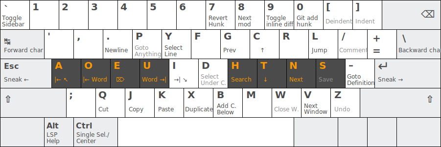

# Sublime Fly keys

This is a set of modal keybindings for Sublime Text. It is inspired by and pays homage to [Xah Fly Keys](https://github.com/xahlee/xah-fly-keys), a set of modal keybindings for Emacs. It does not try to replicate that but rather tries to take Sublime Text's strengths into account. That means multiple cucrsors and text selections have been given prominent keybindings.

What Vim got right was the modality, not the composability. Especially the verb-[quantifier]-object notation seems antiquated. I get it, that model arose because of teletypes and sending data over the network was expensive, but today that is a non-issue, and we should leverage that to create instant feedback to the programmer.

Also, Vim tries to use mnemonics for keybindings. That might seem intuitive in the beginning, but being marginally easier to learn is a bad tradeoff vis-a-vis ergonomics. According to [Xah Lee](http://ergoemacs.org/emacs/command-frequency.html) you are more likely to move right than left in a document, therefore left/right is located on the left hand. Priority is given to command frequency and symmetry.

I did consider for a while to use quantifier modifiers before the keys but ultimately decided against it. It would work okay linewise, for the commands move-10-down for example, or add-cursor-5-up, especially if the user has relative line numbers enabled. But consider the case where you wanted to delete some words. In my Vim experience you often have to stop your flow to count words. Deleting one word at a time is almost always more effective. There is instant feedback and you do not risk deleting too much and having to go back.

Also quantifiers are orthogonal to selections.

Sublime fly keys operate with three modalities. That is _normal mode_, _visual mode_ when there is an active selection, and _insert mode_. In insert mode the keybindings the only active keybinding is `escape`, so  in insert mode there should be no discernible difference between whether or not these keybindings are installed.

It is implemented under the hood by observing and toggling the boolean setting `block_caret`. If true, we are in _normal mode_, and if false, i.e. the cursor looks like a beam ("i-beam"), we are in _insert mode_.

The api is not stable yet, expect changes!

